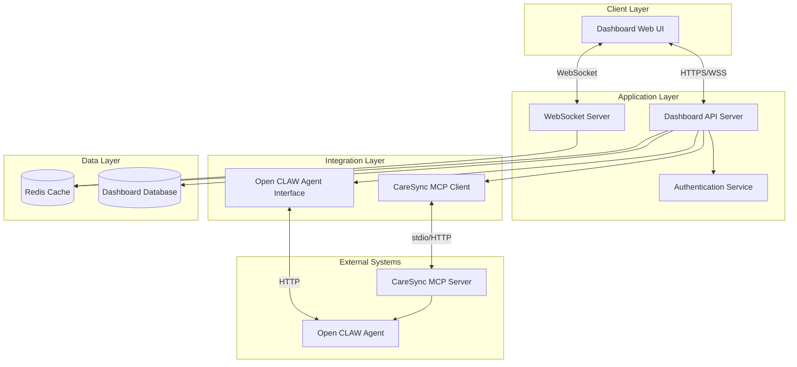

# Design Document: Medical Facility Dashboard

## Overview

The Medical Facility Dashboard is a real-time web application that serves as the operational hub for small medical practices. It provides doctors and medical assistants with a unified view of facility operations, enabling them to manage scheduling policies, monitor room and equipment status, coordinate tasks, and respond to situations requiring human attention.

The system integrates with an Open CLAW AI agent (via the CareSync MCP Server) that autonomously manages scheduling policies and operational tasks. The dashboard surfaces information that requires human decision-making while allowing the AI to handle routine operations in the background.

### Key Design Principles

1. **Human-in-the-Loop**: Surface only what requires human attention or decision-making
2. **Context-Rich**: Provide all relevant information needed to make quick, informed decisions
3. **Real-Time**: Update information within seconds to reflect current facility state
4. **Role-Aware**: Support both single-doctor and multi-doctor management workflows
5. **Graceful Degradation**: Continue operations when AI agent is unavailable

## Architecture

### System Components



### Technology Stack

- **Frontend**: React with TypeScript, WebSocket client for real-time updates
- **Backend**: Node.js with Express, WebSocket server (ws library)
- **Database**: PostgreSQL for persistent data, Redis for real-time state and caching
- **Integration**: MCP client library for CareSync MCP server communication
- **Authentication**: JWT-based authentication with role-based access control

### Communication Patterns

1. **Real-Time Updates**: WebSocket connections push updates to all connected clients
2. **Policy Management**: REST API calls to CareSync MCP Server via MCP client
3. **Task Coordination**: Event-driven architecture with Redis pub/sub for task updates
4. **State Synchronization**: Periodic polling (10s) combined with event-driven updates

## Components and Interfaces

### Frontend Components

#### 1. Dashboard Layout Component
- **Purpose**: Main container providing navigation and layout structure
- **State**: Current user, selected doctor (for multi-doctor view), active section
- **Props**: User role, available doctors, facility configuration

#### 2. Operational Status Panel
- **Purpose**: Display at-a-glance facility status
- **Data Sources**: Room status, patient counts, equipment status
- **Updates**: Real-time via WebSocket
- **Visual Elements**:
  - Room grid showing status (available/occupied/needs cleaning)
  - Patient flow summary (waiting/in exam/in treatment/checking out)
  - Equipment status indicators
  - Current time and operating hours

#### 3. Action Required List
- **Purpose**: Prioritized list of items needing human attention
- **Data Sources**: Action items from AI agent, policy conflicts, equipment issues
- **Interactions**: Mark complete, mark in progress, view details, add notes
- **Sorting**: By urgency (urgent/normal/low) and time waiting
- **Filtering**: By type, assigned doctor, status

#### 4. Scheduling Policy Manager
- **Purpose**: View and manage doctor scheduling policies
- **Data Sources**: CareSync MCP Server via policy_list, policy_get
- **Operations**: Create, update, delete policies via policy_create, policy_update, policy_delete
- **Validation**: Real-time validation via policy_check before committing changes
- **Display**: Organized by policy type with human-readable explanations via policy_explain

#### 5. Task Management Panel
- **Purpose**: View and coordinate operational tasks
- **Data Sources**: Tasks from AI agent and staff-created tasks
- **Interactions**: Create task, reassign task, add notes, mark complete
- **Filtering**: By assignee (staff/AI), status, doctor, task type
- **Display**: Current tasks and completed tasks for current day

#### 6. Multi-Doctor View (for Medical Assistants)
- **Purpose**: Unified view across multiple doctors
- **Data Sources**: Aggregated data from all assigned doctors
- **Features**: Doctor selector, side-by-side schedule comparison, conflict highlighting
- **Interactions**: Quick context switching, filter by doctor, view cross-doctor conflicts

#### 7. Performance Metrics Dashboard
- **Purpose**: Daily operations summary and trends
- **Data Sources**: Aggregated task data, room utilization, patient flow metrics
- **Visualizations**: Charts for task volume, room utilization timeline, wait times
- **Comparisons**: Current day vs 7-day average

### Backend API Endpoints

#### Authentication & Authorization
```
POST   /api/auth/login          - Authenticate user
POST   /api/auth/logout         - End session
GET    /api/auth/me             - Get current user info
```

#### Facility Status
```
GET    /api/facility/status     - Get current facility operational status
GET    /api/rooms               - List all rooms with current status
PUT    /api/rooms/:id/status    - Update room status
GET    /api/equipment           - List equipment with status
PUT    /api/equipment/:id       - Update equipment status
```

#### Action Items
```
GET    /api/actions             - List action required items
POST   /api/actions             - Create new action item
PUT    /api/actions/:id         - Update action item (mark complete, add notes)
DELETE /api/actions/:id         - Delete/dismiss action item
```

#### Scheduling Policies (via CareSync MCP)
```
GET    /api/policies            - List policies (calls policy_list)
GET    /api/policies/:id        - Get policy details (calls policy_get)
POST   /api/policies            - Create policy (calls policy_create)
PUT    /api/policies/:id        - Update policy (calls policy_update)
DELETE /api/policies/:id        - Delete policy (calls policy_delete)
POST   /api/policies/check      - Validate scheduling action (calls policy_check)
GET    /api/policies/:id/explain - Get human explanation (calls policy_explain)
```

#### Tasks
```
GET    /api/tasks               - List operational tasks
POST   /api/tasks               - Create new task
PUT    /api/tasks/:id           - Update task (reassign, add notes, mark complete)
GET    /api/tasks/history       - Get completed tasks with filtering
```

#### Metrics
```
GET    /api/metrics/daily       - Get daily operations summary
GET    /api/metrics/trends      - Get 7-day trend data
```

#### Doctors (for multi-doctor support)
```
GET    /api/doctors             - List doctors (filtered by user's access)
GET    /api/doctors/:id         - Get doctor details
```

### WebSocket Events

#### Client → Server
```
subscribe:facility     - Subscribe to facility status updates
subscribe:actions      - Subscribe to action item updates
subscribe:tasks        - Subscribe to task updates
subscribe:doctor       - Subscribe to specific doctor's updates
```

#### Server → Client
```
facility:status        - Facility status changed
room:updated           - Room status changed
equipment:updated      - Equipment status changed
action:created         - New action item created
action:updated         - Action item updated
action:deleted         - Action item deleted
task:created           - New task created
task:updated           - Task updated
task:completed         - Task completed
policy:conflict        - Policy conflict detected
agent:status           - AI agent status changed
```

### Integration with CareSync MCP Server

The dashboard communicates with the CareSync MCP Server to manage scheduling policies. The MCP client wrapper provides:

```typescript
interface CareSyncMCPClient {
  // List all policies with optional filters
  listPolicies(filters?: {
    doctorId?: string;
    policyType?: PolicyType;
    active?: boolean;
  }): Promise<Policy[]>;
  
  // Get specific policy details
  getPolicy(policyId: string): Promise<Policy>;
  
  // Create new policy with validation
  createPolicy(policy: PolicyInput): Promise<Policy>;
  
  // Update existing policy
  updatePolicy(policyId: string, updates: Partial<PolicyInput>): Promise<Policy>;
  
  // Delete policy
  deletePolicy(policyId: string): Promise<void>;
  
  // Check if scheduling action is valid
  checkPolicy(action: SchedulingAction): Promise<PolicyCheckResult>;
  
  // Get human-readable explanation of policy
  explainPolicy(policyId: string): Promise<string>;
}

type PolicyType = 
  | 'AVAILABILITY'      // Doctor working hours/recurrence
  | 'BLOCK'             // Blocked times (lunch, holidays)
  | 'OVERRIDE'          // One-off overrides (special events)
  | 'DURATION'          // Appointment duration rules
  | 'APPOINTMENT_TYPE'  // Appointment categories
  | 'BOOKING_WINDOW';   // Booking advance limits

interface Policy {
  id: string;
  doctorId: string;
  type: PolicyType;
  active: boolean;
  config: Record<string, any>;  // Type-specific configuration
  createdAt: Date;
  updatedAt: Date;
}

interface PolicyCheckResult {
  valid: boolean;
  conflicts: PolicyConflict[];
  reasoning: string;
}

interface PolicyConflict {
  policyId: string;
  policyType: PolicyType;
  reason: string;
  suggestedResolution?: string;
}
```

### Integration with Open CLAW Agent

The dashboard communicates with the Open CLAW Agent for task management and operational coordination:

```typescript
interface OpenCLAWClient {
  // Get agent status
  getStatus(): Promise<AgentStatus>;
  
  // Get current tasks being executed by agent
  getCurrentTasks(): Promise<Task[]>;
  
  // Get task history
  getTaskHistory(filters?: TaskFilters): Promise<Task[]>;
  
  // Request agent to execute task
  executeTask(task: TaskInput): Promise<Task>;
  
  // Take over task from agent
  takeOverTask(taskId: string, userId: string): Promise<void>;
  
  // Respond to agent request for human input
  respondToAgent(requestId: string, response: any): Promise<void>;
}

interface AgentStatus {
  status: 'active' | 'idle' | 'processing' | 'error' | 'offline';
  lastActivity: Date;
  uptime: number;
  currentTaskCount: number;
  errorMessage?: string;
}

interface Task {
  id: string;
  type: string;
  description: string;
  assignee: 'agent' | string;  // 'agent' or user ID
  status: 'pending' | 'in_progress' | 'completed' | 'failed' | 'cancelled';
  doctorId?: string;
  roomId?: string;
  equipmentId?: string;
  startTime: Date;
  endTime?: Date;
  duration?: number;
  notes: string[];
  createdBy: string;
}
```

## Data Models

### User
```typescript
interface User {
  id: string;
  email: string;
  name: string;
  role: 'doctor' | 'medical_assistant' | 'admin';
  doctorId?: string;  // If role is 'doctor'
  managedDoctorIds?: string[];  // If role is 'medical_assistant'
  createdAt: Date;
  lastLogin: Date;
}
```

### Doctor
```typescript
interface Doctor {
  id: string;
  name: string;
  specialization?: string;
  active: boolean;
  policies: Policy[];  // Scheduling policies
}
```

### Room
```typescript
interface Room {
  id: string;
  name: string;
  type: 'examination' | 'treatment';
  status: 'available' | 'occupied' | 'needs_cleaning' | 'maintenance';
  currentDoctorId?: string;
  currentPatientId?: string;  // Anonymized ID
  equipment?: Equipment[];  // For treatment rooms
  estimatedAvailableAt?: Date;
  lastUpdated: Date;
}
```

### Equipment
```typescript
interface Equipment {
  id: string;
  name: string;
  type: string;  // 'EKG', 'X-Ray', etc.
  roomId?: string;
  status: 'operational' | 'in_use' | 'needs_maintenance' | 'offline';
  lastMaintenanceDate: Date;
  nextMaintenanceDate: Date;
}
```

### ActionItem
```typescript
interface ActionItem {
  id: string;
  type: 'policy_conflict' | 'equipment_issue' | 'agent_request' | 'manual' | 'room_issue';
  urgency: 'urgent' | 'normal' | 'low';
  title: string;
  description: string;
  context: Record<string, any>;  // Related entities and data
  reasoning?: string;  // Why this action is needed
  doctorId?: string;
  roomId?: string;
  equipmentId?: string;
  status: 'pending' | 'in_progress' | 'completed';
  assignedTo?: string;
  createdAt: Date;
  createdBy: string;  // 'agent' or user ID
  completedAt?: Date;
  completedBy?: string;
  timeWaiting: number;  // Calculated field in milliseconds
}
```

### FacilityStatus
```typescript
interface FacilityStatus {
  timestamp: Date;
  operatingHours: {
    open: string;  // HH:MM format
    close: string;
  };
  patientCounts: {
    waiting: number;
    inExamination: number;
    inTreatment: number;
    checkingOut: number;
  };
  roomSummary: {
    examinationRooms: {
      total: number;
      available: number;
      occupied: number;
      needsCleaning: number;
    };
    treatmentRooms: {
      total: number;
      available: number;
      occupied: number;
      needsCleaning: number;
    };
  };
  equipmentSummary: {
    operational: number;
    inUse: number;
    needsMaintenance: number;
    offline: number;
  };
  actionItemCounts: {
    urgent: number;
    normal: number;
    low: number;
  };
}
```

### DailyMetrics
```typescript
interface DailyMetrics {
  date: Date;
  patientsSeen: number;
  averageVisitDuration: number;  // minutes
  averageWaitTime: number;  // minutes
  tasksCompleted: {
    byStaff: number;
    byAgent: number;
    total: number;
  };
  roomUtilization: {
    examinationRooms: number;  // percentage
    treatmentRooms: number;
  };
  taskBreakdown: Record<string, number>;  // task type -> count
  comparisonTo7DayAverage: {
    patientsSeen: number;  // percentage difference
    averageVisitDuration: number;
    averageWaitTime: number;
  };
}
```

## Correctness Properties

*A property is a characteristic or behavior that should hold true across all valid executions of a system—essentially, a formal statement about what the system should do. Properties serve as the bridge between human-readable specifications and machine-verifiable correctness guarantees.*

Before defining the correctness properties, I need to analyze each acceptance criterion to determine which are testable as properties, examples, or edge cases.


### Property 1: Room Status Display Completeness
*For any* facility state with a set of rooms, the dashboard display should include all rooms with their current status, and no rooms should be missing from the display.
**Validates: Requirements 1.1, 1.2**

### Property 2: Patient Count Accuracy
*For any* facility state with patients in various statuses, the displayed patient counts by status (waiting, in examination, in treatment, checking out) should equal the actual count of patients in each status.
**Validates: Requirements 1.3**

### Property 3: Action Item Prioritization
*For any* set of action items with different urgency levels, when displayed as a prioritized list, all urgent items should appear before normal items, and all normal items should appear before low priority items.
**Validates: Requirements 2.1**

### Property 4: Action Item Required Fields
*For any* action item displayed in the dashboard, the rendered output should contain the task description, affected resource, and time waiting.
**Validates: Requirements 2.3**

### Property 5: Action Item State Transitions
*For any* action item in pending status, marking it as completed should result in the item's status changing to completed and it being removed from the active list.
**Validates: Requirements 2.4**

### Property 6: Wait Time Calculation
*For any* set of patient records with arrival and service start times, the calculated average wait time should equal the mean of the differences between service start time and arrival time.
**Validates: Requirements 3.1**

### Property 7: Occupancy Rate Calculation
*For any* set of rooms with status information, the occupancy rate should equal (number of occupied rooms / total rooms) * 100.
**Validates: Requirements 3.2**

### Property 8: Task Display Completeness
*For any* set of operational tasks, the dashboard should display all in-progress tasks and all completed tasks from the current day, with each task showing type, assignee, start time, and status.
**Validates: Requirements 4.1, 4.2, 4.3**

### Property 9: Task Creation and Assignment
*For any* new task created through the dashboard, the task should be added to the system with the specified assignee, and subsequent queries should return the task with that assignee.
**Validates: Requirements 4.4**

### Property 10: Task Reassignment
*For any* existing task, reassigning it from one assignee to another should result in the task's assignee field changing to the new assignee.
**Validates: Requirements 4.5**

### Property 11: Equipment Status Display
*For any* set of medical equipment, the dashboard should display all equipment with their operational status, and equipment marked as needs maintenance or offline should have corresponding action items created.
**Validates: Requirements 5.1, 5.2**

### Property 12: Equipment Maintenance Logging
*For any* equipment, updating its status or logging maintenance should result in the equipment record reflecting the new status and maintenance date.
**Validates: Requirements 5.5**

### Property 13: Action Item Context Completeness
*For any* action item, when selected, the returned context should include all related entities (patient, room, equipment, task history) referenced in the action item.
**Validates: Requirements 6.1**

### Property 14: Task Notes Persistence
*For any* operational task, adding a note should result in the note being appended to the task's notes array and being retrievable in subsequent queries.
**Validates: Requirements 7.1**

### Property 15: Daily Patient Count
*For any* set of patient visit records for a given day, the displayed total patients seen should equal the count of unique patients with visits on that day.
**Validates: Requirements 8.1**

### Property 16: Visit Duration Calculation
*For any* set of patient visits with start and end times, the calculated average visit duration should equal the mean of the differences between end time and start time.
**Validates: Requirements 8.2**

### Property 17: Task Completion Categorization
*For any* set of completed tasks, the count of tasks completed by staff should equal the number of tasks with staff assignees, and the count by agent should equal tasks with agent assignee.
**Validates: Requirements 8.3**

### Property 18: Room Utilization Calculation
*For any* set of room usage records for a day, the utilization percentage should equal (total occupied time / total available time) * 100.
**Validates: Requirements 8.4**

### Property 19: Agent Failure Handling
*For any* task assigned to the agent that fails, an action item should be created with the task details and marked as requiring human attention.
**Validates: Requirements 9.1**

### Property 20: Agent Unavailability Routing
*For any* new task created when the agent status is offline or unavailable, the task should be automatically assigned to staff members rather than the agent.
**Validates: Requirements 9.2**

### Property 21: Task Takeover
*For any* task currently assigned to the agent, when a staff member takes over the task, the task's assignee should change from agent to that staff member's ID.
**Validates: Requirements 9.4**

### Property 22: Authentication Requirement
*For any* API request to dashboard endpoints without valid authentication credentials, the request should be rejected with an authentication error.
**Validates: Requirements 11.1**

### Property 23: Audit Log Completeness
*For any* staff member action (task update, status change, note addition), an audit log entry should be created containing the action type, timestamp, user ID, and affected resource.
**Validates: Requirements 11.3**

### Property 24: PII Filtering
*For any* task description or log entry containing patient identifiable information (names, medical record numbers), the displayed output should have PII redacted or anonymized.
**Validates: Requirements 11.5**

### Property 25: Policy Display Organization
*For any* doctor with scheduling policies, the dashboard should display all active policies grouped by policy type (AVAILABILITY, BLOCK, OVERRIDE, DURATION, APPOINTMENT_TYPE, BOOKING_WINDOW).
**Validates: Requirements 12.1**

### Property 26: Policy Creation Validation
*For any* new scheduling policy, creating it should validate against existing policies, and if conflicts exist, the creation should fail with conflict details.
**Validates: Requirements 12.3**

### Property 27: Policy Modification
*For any* existing scheduling policy, updating or deleting it should result in the policy record reflecting the changes or being removed from the active policies list.
**Validates: Requirements 12.4**

### Property 28: Scheduling Action Validation
*For any* proposed scheduling action, validating it should return a result indicating whether it's valid, and if invalid, which policies are violated and why.
**Validates: Requirements 13.1, 13.3, 13.4, 13.5**

### Property 29: Multi-Doctor Task Filtering
*For any* set of tasks and action items across multiple doctors, filtering by a specific doctor ID should return only items associated with that doctor.
**Validates: Requirements 14.2**

### Property 30: Cross-Doctor Conflict Detection
*For any* set of scheduling actions or resource allocations involving multiple doctors, conflicts where two doctors need the same resource at the same time should be detected and highlighted.
**Validates: Requirements 14.5**


## Error Handling

### Error Categories

#### 1. Integration Errors (CareSync MCP Server)
- **Connection Failures**: MCP server unavailable or not responding
- **Policy Validation Errors**: Invalid policy configuration or conflicts
- **Timeout Errors**: MCP operations exceeding timeout threshold

**Handling Strategy**:
- Retry with exponential backoff (3 attempts)
- Display user-friendly error message with suggested actions
- Log detailed error for debugging
- Fall back to cached policy data if available
- Create action item for administrator if persistent

#### 2. Integration Errors (Open CLAW Agent)
- **Agent Offline**: Agent not responding to health checks
- **Task Execution Failures**: Agent unable to complete assigned task
- **Communication Errors**: Network or protocol issues

**Handling Strategy**:
- Display agent status prominently in dashboard
- Automatically route new tasks to staff when agent offline
- Create action items for failed tasks with context
- Maintain task queue for when agent returns online
- Log all agent communication errors

#### 3. Data Validation Errors
- **Invalid Input**: User-provided data fails validation rules
- **Constraint Violations**: Data violates business rules or constraints
- **Type Errors**: Data type mismatches

**Handling Strategy**:
- Validate on client side before submission
- Return detailed validation errors from API
- Highlight specific fields with errors in UI
- Provide clear guidance on how to fix errors
- Prevent submission until validation passes

#### 4. Authentication and Authorization Errors
- **Unauthenticated Requests**: No valid session or token
- **Unauthorized Access**: User lacks permission for action
- **Session Expiration**: Token expired during session

**Handling Strategy**:
- Redirect to login page for unauthenticated requests
- Display permission denied message for unauthorized actions
- Show session expiration warning 5 minutes before timeout
- Preserve user's work when session expires (local storage)
- Log all authentication failures for security audit

#### 5. Real-Time Update Errors
- **WebSocket Disconnection**: Connection lost to server
- **Message Delivery Failures**: Updates not reaching client
- **State Synchronization Issues**: Client state out of sync with server

**Handling Strategy**:
- Automatically attempt to reconnect WebSocket (exponential backoff)
- Display connection status indicator in UI
- Fetch latest state from API on reconnection
- Queue updates locally during disconnection
- Notify user if updates may be stale

#### 6. Database Errors
- **Query Failures**: Database query errors or timeouts
- **Connection Pool Exhaustion**: No available database connections
- **Data Integrity Violations**: Constraint violations or deadlocks

**Handling Strategy**:
- Retry transient errors (deadlocks, timeouts)
- Return 500 error with generic message to client
- Log detailed error with stack trace for debugging
- Alert operations team for persistent database issues
- Implement circuit breaker for database connections

### Error Response Format

All API errors follow a consistent format:

```typescript
interface ErrorResponse {
  error: {
    code: string;           // Machine-readable error code
    message: string;        // Human-readable error message
    details?: any;          // Additional error context
    field?: string;         // Specific field for validation errors
    retryable: boolean;     // Whether client should retry
    timestamp: Date;        // When error occurred
  };
}
```

### Error Codes

- `AUTH_REQUIRED`: Authentication required
- `AUTH_INVALID`: Invalid credentials
- `AUTH_EXPIRED`: Session expired
- `PERMISSION_DENIED`: Insufficient permissions
- `VALIDATION_ERROR`: Input validation failed
- `NOT_FOUND`: Resource not found
- `CONFLICT`: Resource conflict (e.g., policy conflict)
- `MCP_UNAVAILABLE`: CareSync MCP server unavailable
- `AGENT_OFFLINE`: Open CLAW agent offline
- `AGENT_FAILED`: Agent task execution failed
- `DATABASE_ERROR`: Database operation failed
- `INTERNAL_ERROR`: Unexpected server error
- `RATE_LIMIT`: Too many requests

### Graceful Degradation

When external systems are unavailable, the dashboard continues to operate with reduced functionality:

1. **MCP Server Unavailable**:
   - Display cached policy data (read-only)
   - Disable policy creation/modification
   - Show warning banner about limited functionality
   - Queue policy changes for when service returns

2. **Open CLAW Agent Offline**:
   - Display agent offline status prominently
   - Route all new tasks to staff
   - Show last known agent status and tasks
   - Continue displaying historical agent data

3. **Database Connection Issues**:
   - Serve cached data from Redis
   - Disable write operations
   - Display warning about potential stale data
   - Queue writes for when database returns

## Testing Strategy

### Dual Testing Approach

The testing strategy employs both unit tests and property-based tests as complementary approaches:

- **Unit Tests**: Verify specific examples, edge cases, and error conditions
- **Property Tests**: Verify universal properties across all inputs

Together, these provide comprehensive coverage where unit tests catch concrete bugs and property tests verify general correctness.

### Property-Based Testing

**Library**: fast-check (for TypeScript/JavaScript)

**Configuration**:
- Minimum 100 iterations per property test
- Each property test references its design document property
- Tag format: `Feature: medical-facility-dashboard, Property {number}: {property_text}`

**Property Test Examples**:

```typescript
// Property 2: Patient Count Accuracy
test('Feature: medical-facility-dashboard, Property 2: Patient count accuracy', () => {
  fc.assert(
    fc.property(
      fc.array(patientArbitrary()),
      (patients) => {
        const facilityState = createFacilityState(patients);
        const display = renderDashboard(facilityState);
        
        const expectedCounts = {
          waiting: patients.filter(p => p.status === 'waiting').length,
          inExamination: patients.filter(p => p.status === 'in_examination').length,
          inTreatment: patients.filter(p => p.status === 'in_treatment').length,
          checkingOut: patients.filter(p => p.status === 'checking_out').length
        };
        
        expect(display.patientCounts).toEqual(expectedCounts);
      }
    ),
    { numRuns: 100 }
  );
});

// Property 7: Occupancy Rate Calculation
test('Feature: medical-facility-dashboard, Property 7: Occupancy rate calculation', () => {
  fc.assert(
    fc.property(
      fc.array(roomArbitrary(), { minLength: 1 }),
      (rooms) => {
        const occupiedCount = rooms.filter(r => r.status === 'occupied').length;
        const expectedRate = (occupiedCount / rooms.length) * 100;
        
        const calculatedRate = calculateOccupancyRate(rooms);
        
        expect(calculatedRate).toBeCloseTo(expectedRate, 2);
      }
    ),
    { numRuns: 100 }
  );
});

// Property 28: Scheduling Action Validation
test('Feature: medical-facility-dashboard, Property 28: Scheduling action validation', () => {
  fc.assert(
    fc.property(
      fc.array(policyArbitrary()),
      schedulingActionArbitrary(),
      (policies, action) => {
        const result = validateSchedulingAction(action, policies);
        
        // Result should always have valid boolean and reasoning
        expect(typeof result.valid).toBe('boolean');
        expect(typeof result.reasoning).toBe('string');
        
        // If invalid, should have conflicts array
        if (!result.valid) {
          expect(Array.isArray(result.conflicts)).toBe(true);
          expect(result.conflicts.length).toBeGreaterThan(0);
          
          // Each conflict should have required fields
          result.conflicts.forEach(conflict => {
            expect(conflict.policyId).toBeDefined();
            expect(conflict.policyType).toBeDefined();
            expect(conflict.reason).toBeDefined();
          });
        }
      }
    ),
    { numRuns: 100 }
  );
});
```

### Unit Testing

**Framework**: Jest (for TypeScript/JavaScript)

**Focus Areas**:
1. **Specific Examples**: Test known scenarios with expected outcomes
2. **Edge Cases**: Empty lists, null values, boundary conditions
3. **Error Conditions**: Invalid inputs, missing data, constraint violations
4. **Integration Points**: API endpoints, MCP client, WebSocket events

**Unit Test Examples**:

```typescript
// Specific example: Empty facility state
test('displays zero counts for empty facility', () => {
  const emptyState = createEmptyFacilityState();
  const display = renderDashboard(emptyState);
  
  expect(display.patientCounts.waiting).toBe(0);
  expect(display.patientCounts.inExamination).toBe(0);
  expect(display.roomSummary.examinationRooms.occupied).toBe(0);
});

// Edge case: Single patient
test('handles single patient correctly', () => {
  const state = createFacilityState([
    { id: '1', status: 'waiting', arrivalTime: new Date() }
  ]);
  const display = renderDashboard(state);
  
  expect(display.patientCounts.waiting).toBe(1);
  expect(display.patientCounts.inExamination).toBe(0);
});

// Error condition: Invalid policy type
test('rejects policy creation with invalid type', async () => {
  const invalidPolicy = {
    doctorId: 'doc1',
    type: 'INVALID_TYPE',
    config: {}
  };
  
  await expect(createPolicy(invalidPolicy)).rejects.toThrow('Invalid policy type');
});

// Integration: MCP server unavailable
test('handles MCP server unavailable gracefully', async () => {
  mockMCPClient.listPolicies.mockRejectedValue(new Error('Connection refused'));
  
  const response = await request(app).get('/api/policies');
  
  expect(response.status).toBe(503);
  expect(response.body.error.code).toBe('MCP_UNAVAILABLE');
  expect(response.body.error.retryable).toBe(true);
});
```

### Integration Testing

**Focus**: End-to-end workflows and system interactions

**Key Scenarios**:
1. User authentication and session management
2. Real-time updates via WebSocket
3. Policy creation and validation via MCP server
4. Task assignment and completion workflow
5. Multi-doctor context switching
6. Agent offline handling and task routing

### Test Data Generators (Arbitraries)

Property-based tests require generators for random test data:

```typescript
// Generate random patients
const patientArbitrary = () => fc.record({
  id: fc.uuid(),
  status: fc.constantFrom('waiting', 'in_examination', 'in_treatment', 'checking_out'),
  arrivalTime: fc.date(),
  serviceStartTime: fc.option(fc.date())
});

// Generate random rooms
const roomArbitrary = () => fc.record({
  id: fc.uuid(),
  name: fc.string({ minLength: 1, maxLength: 20 }),
  type: fc.constantFrom('examination', 'treatment'),
  status: fc.constantFrom('available', 'occupied', 'needs_cleaning', 'maintenance'),
  currentDoctorId: fc.option(fc.uuid())
});

// Generate random scheduling policies
const policyArbitrary = () => fc.record({
  id: fc.uuid(),
  doctorId: fc.uuid(),
  type: fc.constantFrom('AVAILABILITY', 'BLOCK', 'OVERRIDE', 'DURATION', 'APPOINTMENT_TYPE', 'BOOKING_WINDOW'),
  active: fc.boolean(),
  config: fc.object()
});

// Generate random scheduling actions
const schedulingActionArbitrary = () => fc.record({
  doctorId: fc.uuid(),
  appointmentType: fc.string(),
  startTime: fc.date(),
  duration: fc.integer({ min: 15, max: 120 })
});
```

### Test Coverage Goals

- **Unit Test Coverage**: Minimum 80% code coverage
- **Property Test Coverage**: All 30 correctness properties implemented
- **Integration Test Coverage**: All critical user workflows
- **Error Path Coverage**: All error handling paths tested

### Continuous Testing

- Run unit tests on every commit
- Run property tests on every pull request
- Run integration tests nightly
- Monitor test execution time and optimize slow tests
- Track flaky tests and fix root causes

## Implementation Notes

### Performance Considerations

1. **Database Queries**: Use indexes on frequently queried fields (doctorId, status, date)
2. **Caching**: Cache facility status, room status, and policy data in Redis (TTL: 10s)
3. **WebSocket Scaling**: Use Redis pub/sub for multi-server WebSocket synchronization
4. **Pagination**: Implement pagination for task history and audit logs
5. **Query Optimization**: Use database views for complex aggregations (daily metrics)

### Security Considerations

1. **Input Validation**: Validate all user inputs on both client and server
2. **SQL Injection**: Use parameterized queries for all database operations
3. **XSS Prevention**: Sanitize all user-generated content before display
4. **CSRF Protection**: Implement CSRF tokens for state-changing operations
5. **Rate Limiting**: Limit API requests per user (100 requests/minute)
6. **Audit Logging**: Log all security-relevant events (auth failures, permission denials)

### Scalability Considerations

1. **Horizontal Scaling**: Design API server to be stateless for horizontal scaling
2. **Database Connection Pooling**: Use connection pooling (max 20 connections per instance)
3. **WebSocket Load Balancing**: Use sticky sessions for WebSocket connections
4. **Caching Strategy**: Implement multi-level caching (Redis + in-memory)
5. **Async Processing**: Use job queue for long-running operations (report generation)

### Monitoring and Observability

1. **Metrics**: Track API response times, error rates, WebSocket connection count
2. **Logging**: Structured logging with correlation IDs for request tracing
3. **Alerting**: Alert on high error rates, MCP/agent unavailability, database issues
4. **Dashboards**: Create operational dashboards for system health monitoring
5. **Tracing**: Implement distributed tracing for debugging complex workflows
